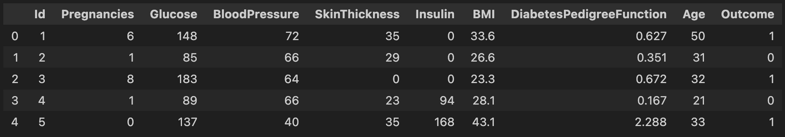
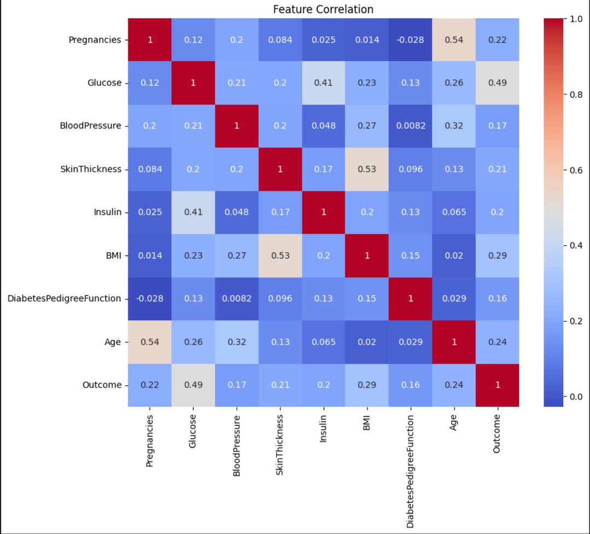
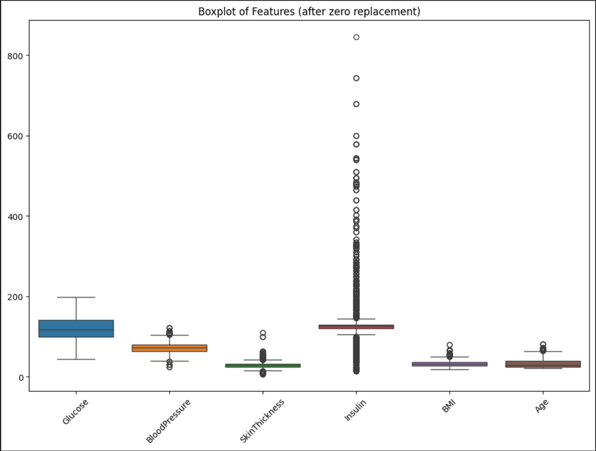
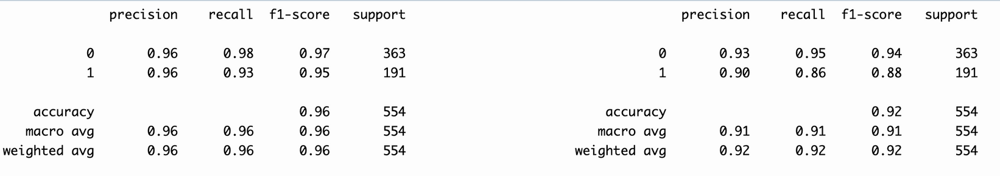
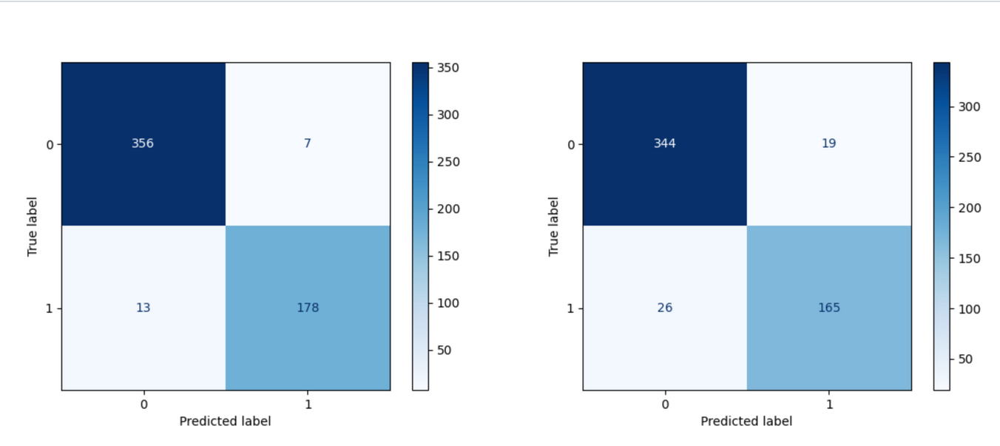
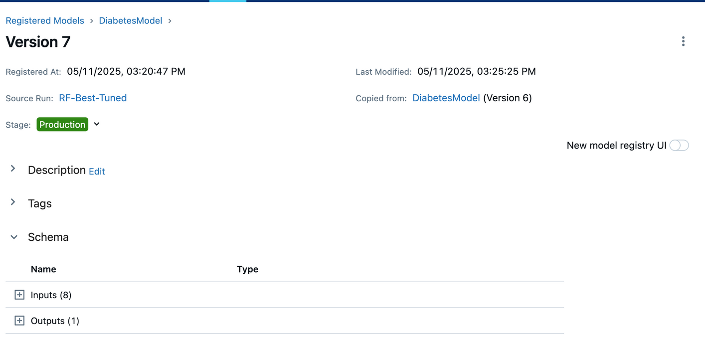
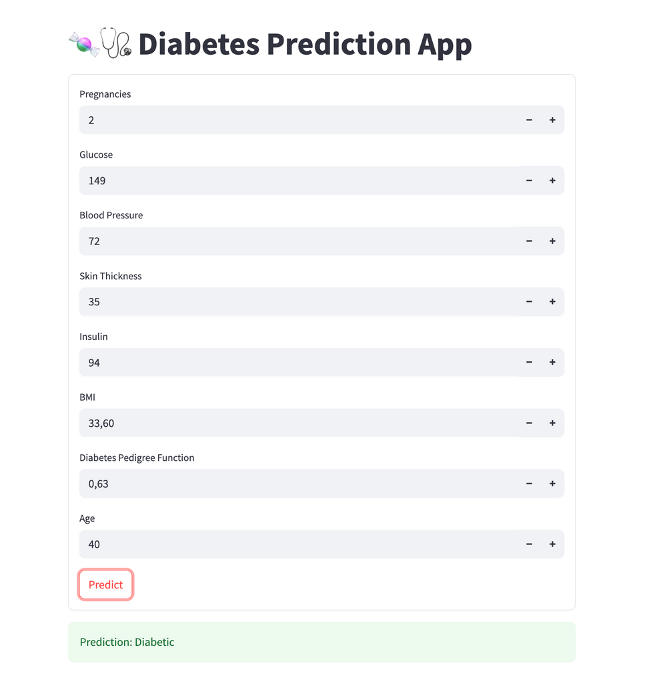
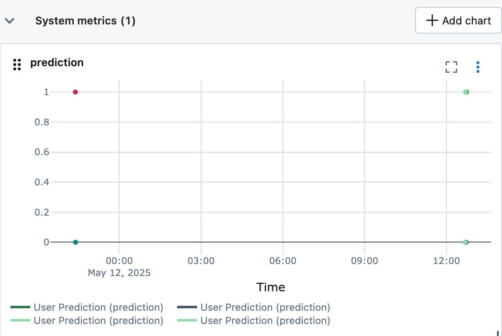

# 🩺 Diabetes Prediction with MLflow

An end-to-end MLOps pipeline that predicts diabetes from patient health data, built with **MLflow** for experiment tracking, model registry, deployment, and monitoring — plus a **Streamlit** app for live predictions.

---

## Contents
1. [Data Preprocessing & EDA](#1-data-preprocessing--eda)
2. [Model Training](#2-model-training)
3. [Comparing Best Models](#3-comparing-best-models)
4. [Model Registry & Deployment](#4-model-registry--deployment)
5. [Streamlit App](#5-streamlit-app)
6. [Monitoring Setup](#6-monitoring-setup)
7. [Conclusion](#7-conclusion)

---

## 1. Data Preprocessing & EDA

- Loaded the diabetes dataset from Kaggle (`Healthcare-Diabetes.csv`)
- Cleaned the data by imputing invalid values — zeros in columns like Glucose, BloodPressure, SkinThickness, Insulin, BMI, and Age don't make biological sense, so they were replaced with the column median
- Explored feature distributions and correlations before modeling







---

## 2. Model Training

Using **Scikit-learn**, three models were trained:
- Logistic Regression
- Random Forest
- SVM

Hyperparameter tuning was done using **Hyperopt** for all models, then registered the best model as `<model name>-Best-Tuned`.

Every training session — baseline and tuned — was logged to MLflow under the `Diabetes_Prediction_Experiment` experiment, with full parameter sets, evaluation metrics, and model artifacts.

---

## 3. Comparing Best Models

Each model's best hyperparameters and performance were compared side by side using the MLflow UI.





The tuned Random Forest reached **96% accuracy**, outperforming the untuned baseline (92%).

---

## 4. Model Registry & Deployment

- The best model was transitioned to the **Production** stage manually via the MLflow UI
- Served using the `mlflow models serve` command as a REST API



```bash
mlflow models serve -m "models:/DiabetesModel/Production" -p 1234 --no-conda
```

---

## 5. Streamlit App

- Built an interactive web app using Streamlit
- Users can input health data like glucose, BMI, age, etc.
- The app sends the data to the deployed MLflow model API
- The model returns a prediction: **Diabetic** or **Not Diabetic**



```bash
streamlit run app.py
```

---

## 6. Monitoring Setup

- Created a new MLflow experiment called `Diabetes_Monitoring`
- Each prediction made through the Streamlit app is logged with user input values and the prediction result
- Used the MLflow UI to visualize predictions over time
- Helped identify potential drift or imbalance in model predictions



---

## 7. Conclusion

- ✅ Successfully implemented a full MLOps pipeline with MLflow
- ✅ Tracked all model training runs with metrics and parameters
- ✅ Deployed the best model and built an interactive prediction app
- ✅ Enabled real-time prediction logging for ongoing performance monitoring

